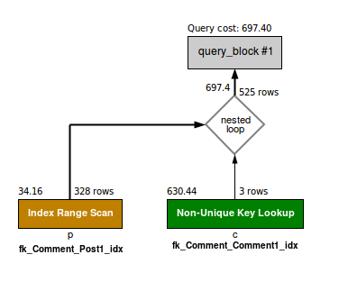
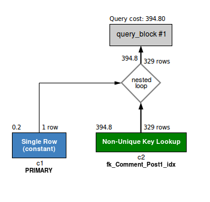

## Запрос 1

Содержит JOIN таблицы с самой собой по полю Comment_id.

К особенностям можно отнести:

* Будут выведены только комментарии, оставленные на комментарии
    * Хорошо,т.к количество выгружаемых данных меньше
    * Плохо, если нужен сам "рутовый" комментарий, т.к. необходим доп запрос
* Дополнительно помимо `Comment_id` необходимо поле `Post_id` (можно получить подзапросом,
но раз отдельным запросом получен "рутовый комментрий" это излишне)
* Будут выведены комментарии только начиная с id родителя
```sqlite-sql
1. SELECT
2. 	p.id pid, c.id cid, c.User_id, c.data
3. FROM 
4. 	Comment p
5. JOIN
6. 	Comment c ON p.id=c.Comment_id
7. WHERE
8.	p.Post_id=10 AND p.id>=100000;
```
EXPLAIN:
```
1	SIMPLE	p		range	PRIMARY,fk_Comment_Post1_idx	fk_Comment_Post1_idx	9		328	100.00	Using where; Using index
1	SIMPLE	c		ref	fk_Comment_Comment1_idx	fk_Comment_Comment1_idx	5	blog.p.id	3	100.00	
```


* Range – индекс, использованный для нахождения соответствующей строки в определенном диапазоне (WHERE >)

## Запрос 2

Содержит JOIN таблицы с самой собой по полю Post, т.к. для таблицы c1
задан блок WHERE с id, то будут выведены все комментарии под тем же постом, что и коммент c id.

К особенностям можно отнести:
* Будут выведены все комментарии к посту
* Будет включен рутовый комментарий, доп запросы не нужны
* Количество данных выгружаемых из бд, больше, чем в запросе 1, но стоимость выбора меньше
```sqlite-sql
1.SELECT
2.	c1.id, c2.id, c2.Comment_id, c2.data
3.FROM
4.	Comment c1
5.JOIN
6.	Comment c2 ON c1.Post_id = c2.Post_id
7.WHERE
8.	c1.id=100000;
```
EXPLAIN:
```
1	SIMPLE	c1		const	PRIMARY,fk_Comment_Post1_idx   	PRIMARY	4	const	1	100.00	
1	SIMPLE	c2		ref	fk_Comment_Post1_idxfk_Comment_Post1_idx 5	const	329	100.00	
```

* SIMPLE — Простой запрос SELECT без подзапросов или UNION
* Const – таблица имеет только одну соответствующую строку, которая проиндексирована. Это наиболее быстрый тип соединения потому, что таблица читается только один раз и значение строки может восприниматься при дальнейших соединениях как константа
* Ref – все соответствующие строки индексного столбца считываются для каждой комбинации строк из предыдущей таблицы (JOIN ON =)
* Оба запроса имеют все необходимые индексы видно из полей (possible_keys, key)

По сути эквивалентен запросу:
```
SELECT
	id, Comment_id, data
FROM
	Comment
WHERE
	Post_id = (SELECT Post_id FROM Comment WHERE id = 9010)
```